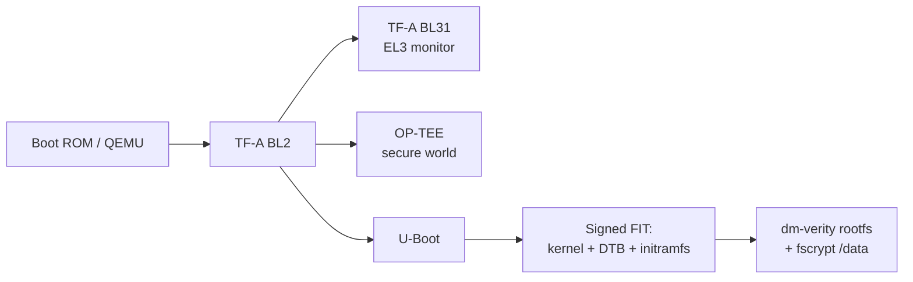

# secure-boot-linux

A production-style secure boot chain for an ARM64 embedded Linux platform, built with Yocto and run on QEMU. The goal is to reproduce what an automotive compute platform needs: every boot stage is cryptographically verified from the first loader to the root filesystem, secrets live in the TrustZone secure world, writable data is encrypted, and a failed update rolls back automatically through A/B slots. The project also includes a Linux platform driver, a C++17 shared-memory IPC channel (tested with gtest, built with Bazel), and a CVE triage workflow using Yocto's cve-check and an SBOM.

> Status: in progress. Stages are checked off below as they are completed, each with boot logs in `docs/`.

## Boot chain

1. **Boot ROM (QEMU)**: starts execution at EL3 and loads the first-stage loader.
2. **TF-A BL2**: initializes memory, then loads and verifies BL31, OP-TEE and U-Boot (Trusted Board Boot).
3. **TF-A BL31**: EL3 secure monitor; stays resident for PSCI and secure/normal world switching.
4. **OP-TEE (BL32)**: trusted OS in the secure world; hosts Trusted Applications for key handling.
5. **U-Boot (BL33)**: selects the A/B slot, then loads and verifies a signed FIT image (kernel, device tree, initramfs).
6. **Linux kernel**: parses the device tree, probes drivers, boots with a command line carrying the dm-verity root hash.
7. **initramfs**: sets up dm-verity on the read-only root filesystem and switches root.
8. **Userspace (systemd)**: unlocks the fscrypt-encrypted `/data` partition and marks the boot successful, which resets the bootcount.

## Roadmap

- [X] L1: OP-TEE QEMU v8 reference build boots end to end; each stage labeled in the boot log
- [ ] L2: Yocto (poky + meta-arm, `qemuarm64-secureboot`) with a custom layer, a C++ app recipe with gtest, and a kernel config bbappend
- [ ] L3: signed FIT images enforced by U-Boot; dm-verity read-only rootfs; tampered-image rejection demo
- [ ] L4: fscrypt `/data` partition; OP-TEE hello-world Trusted Application; cve-check report and SBOM
- [ ] L5: C++17 lock-free SPSC ring buffer over POSIX shared memory, built with Bazel, tested with gtest, latency benchmark
- [ ] L6: Linux platform driver with a device-tree binding, IRQ handler and char-device/ioctl interface, as a Yocto kernel-module recipe
- [ ] A/B update with bootcount / bootlimit / altbootcmd rollback demo

## Tech

Yocto/OpenEmbedded · Arm Trusted Firmware (TF-A) · OP-TEE · U-Boot · Linux · dm-verity · fscrypt · C++17 · gtest · Bazel · Docker · QEMU (ARM64)
